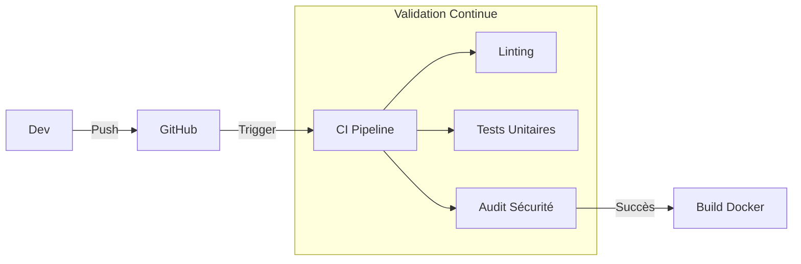
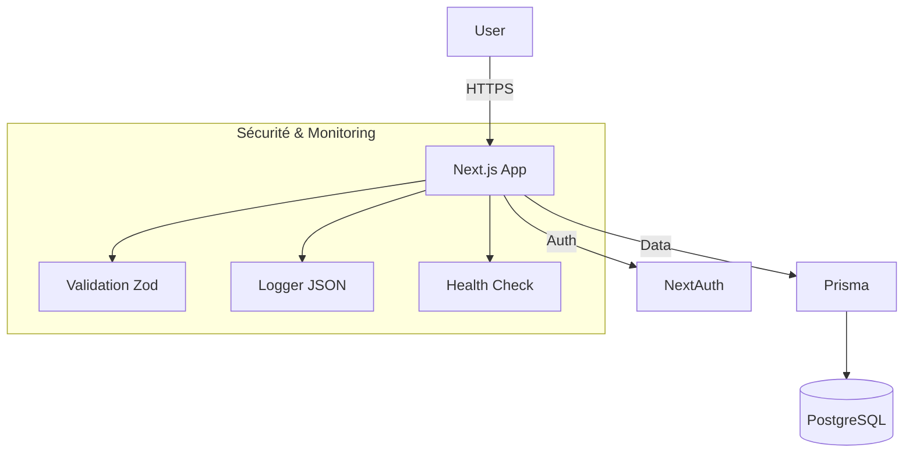

# Support de Présentation Orale (20 min)

Ce document contient la structure, le script et les schémas pour votre soutenance.

## 🟢 Introduction (3 min)

**Slide 1 : Titre & Contexte**
*   **Titre** : Superviser et Assurer le Développement - Projet Collector
*   **Discours** :
    > "Bonjour, je suis [Votre Nom], Lead Developer pour le projet Collector.
    > Ma mission aujourd'hui est de vous présenter la stratégie technique mise en place pour développer et sécuriser notre plateforme de marketplace.
    > J'ai structuré mon intervention en trois temps :
    > 1.  Le cadre méthodologique et qualité (DevSecOps).
    > 2.  La démonstration technique de la solution (POC).
    > 3.  Le plan d'amélioration continue."

**Slide 2 : Objectifs de la Mission**
*   **Points clés** :
    *   Qualité Logicielle (ISO 25010).
    *   Sécurité dès la conception.
    *   Scalabilité (Montée en charge).

## 🔵 Partie 1 : Processus & Qualité (5 min)

**Slide 3 : Démarche Qualité (ISO 25010)**
*   **Visuel** : Tableau des indicateurs (voir Rapport).
*   **Discours** :
    > "Pour garantir la pérennité du projet, j'ai défini 4 indicateurs clés.
    > Par exemple, nous visons un temps de réponse < 200ms pour l'efficacité, et une couverture de tests > 80% pour la fiabilité.
    > Ces métriques sont suivies automatiquement dans notre pipeline CI/CD."

**Slide 4 : Architecture CI/CD (DevSecOps)**
*   **Visuel** : *Schéma CI/CD (Mermaid ci-dessous)*
*   **Discours** :
    > "Nous avons automatisé le cycle de vie avec GitHub Actions.
    > Chaque commit déclenche : Linting, Tests Unitaires, et surtout un Audit de Sécurité (npm audit) pour bloquer les vulnérabilités critique avant même la mise en prod.
    > C'est ce qui nous permet de livrer sans régression."

## 🟠 Partie 2 : Le POC Technique (10 min - Cœur de la soutenance)

**Slide 5 : Architecture Applicative**
*   **Visuel** : *Schéma Technique (Mermaid ci-dessous)*
*   **Discours** :
    > "L'application repose sur une stack moderne et robuste : Next.js pour le SSR, Prisma pour la gestion de données, et NextAuth pour la sécurité."

**Slide 6 : Démonstration Fonctionnelle (DÉMO)**
*   **Action** : *Partage d'écran sur l'application.*
*   **Scénario** :
    1.  Montrer la page d'accueil (Listing).
    2.  Aller sur `/sell` (Redirection Login immédiate -> Preuve de sécurité).
    3.  Se connecter.
    4.  Créer une annonce (Montrer que si on met un prix négatif, l'API bloque -> Validation Zod).
    5.  Publier l'annonce avec succès.

**Slide 7 : Démonstration de Charge (DÉMO)**
*   **Action** : *Lancer le script de stress test.*
*   **Discours** :
    > "Pour prouver la robustesse, je lance un test de charge simulant 50 utilisateurs simultanés."
*   **Commande** : `node stress-test.js`
*   **Commentaire résultats** : "On voit que l'API tient la charge avec un temps de réponse moyen stable."

**Slide 8 : Supervision & Disponibilité**
*   **Visuel** : Screenshot du JSON `/api/health` ou Logs.
*   **Discours** :
    > "Coté Ops, nous avons exposé une route de monitoring `/api/health` qui permet à l'orchestrateur de vérifier la santé du service en temps réel."

## 🟣 Partie 3 : Améliorations & Conclusion (2 min)

**Slide 9 : Plan de Remédiation**
*   **Points clés** :
    *   Court terme : Rate Limiting (Protection DDoS).
    *   Moyen terme : 2FA pour les admins.
*   **Discours** :
    > "Le POC est sécurisé pour un lancement bêta, mais pour l'ouverture publique, nous ajouterons un Rate Limiting pour éviter les abus."

**Slide 10 : Conclusion**
*   **Discours** :
    > "En conclusion, nous avons une base saine, documentée (Contributing Guide), testée et monitorée. L'équipe est prête pour la phase d'industrialisation."

---

## 🛠️ Préparation pour le Jour J
- [ ] Lancer le serveur : `npm run dev`
- [ ] Ouvrir un terminal prêt pour `node stress-test.js`
- [ ] Avoir GitHub ouvert sur l'onglet "Actions" pour montrer un pipeline vert.
