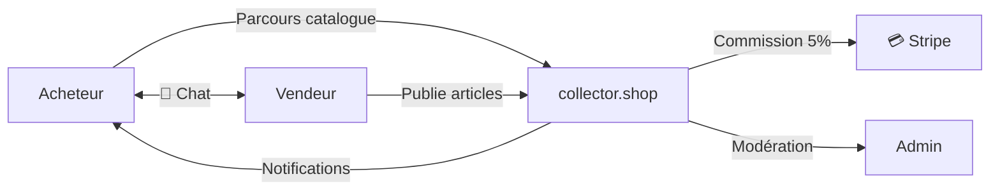
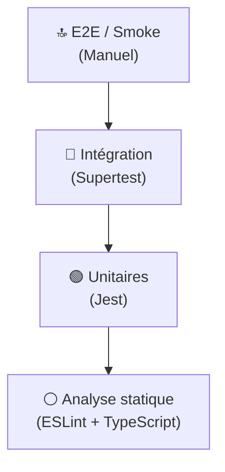
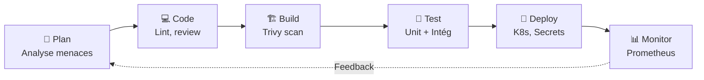
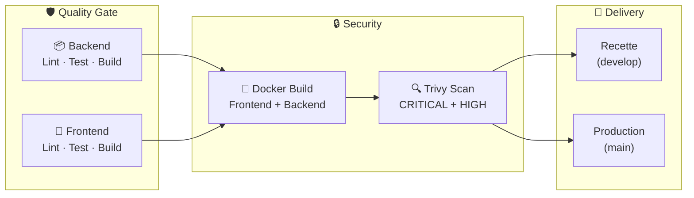
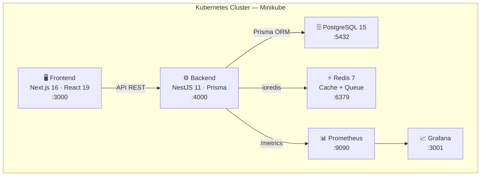
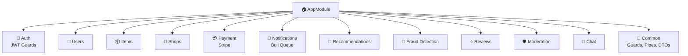

# Collector.shop

## Superviser et assurer le développement d'applications logicielles

<div class="pt-8 text-lg opacity-80">

**Lucas Labonde** — Lead Developer

Soutenance de bloc — Février 2026

</div>

<div class="abs-br m-6 text-sm opacity-60">
  20 min · Démo incluse
</div>

---

# Sommaire

<div class="grid grid-cols-2 gap-8 mt-4">
<div>

### 🏗️ Phase 1 — Structuration
- Contexte & consignes
- Qualité · Tests · Sécurité
- Pipeline CI/CD
- Compétences équipe

### ⚙️ Phase 2 — Développement
- Architecture & choix techniques
- Expérimentation bac à sable
- Backlog & fonctionnalité métier

</div>
<div>

### 🛡️ Phase 3 — Remédiation
- Audit sécurité
- Plan de remédiation priorisé
- Analyse des métriques

### 🖥️ Démo Live
- POC fonctionnel
- Scalabilité (HPA Kubernetes)

</div>
</div>

---

# Contexte — Collector

<div class="grid grid-cols-2 gap-8">
<div>

### L'entreprise
- Start-up française, pivot événementiel → digital
- Objets de collection vintage (sneakers, figurines, posters…)
- Équipe IT : **1 Lead Dev** + 2 développeurs confirmés

</div>
<div>

### collector.shop — Marketplace C2C
- Commission **5%** / transaction
- Rôles : Acheteur · Vendeur · Admin
- Chat, paiement Stripe, notifications, détection fraude

</div>
</div>



---

# Rappel des Consignes

<div class="grid grid-cols-3 gap-4 text-sm">
<div class="border border-blue-500/30 rounded-lg p-4 bg-blue-500/5">

### Phase 1
- 4 indicateurs qualité ISO 25010
- Cycle DevSecOps + CI/CD
- Politique tests + sécurité
- Cartographie compétences + formation

</div>
<div class="border border-green-500/30 rounded-lg p-4 bg-green-500/5">

### Phase 2
- Architecture technique + backlog
- Expérimentation bac à sable
- POC avec ≥1 fonctionnalité métier
- ≥2 types de tests en CI
- Démo montée en charge

</div>
<div class="border border-orange-500/30 rounded-lg p-4 bg-orange-500/5">

### Phase 3
- Audit sécurité de la V1
- Identification vulnérabilités
- Plan de remédiation priorisé

</div>
</div>

---
layout: section
---

# Phase 1 — Structuration

## Qualité · Tests · Sécurité

---

# Politique de Qualité — 4 Indicateurs ISO 25010

| # | Indicateur | Exigence ISO | Objectif | Outil de mesure |
|---|---|---|---|---|
| 1 | **Couverture de code** | Maintenabilité | ≥ 70% | `jest --coverage` |
| 2 | **Temps de build CI** | Performance | < 5 min | GitHub Actions |
| 3 | **Vulnérabilités critiques** | Sécurité | 0 CRITICAL | Trivy |
| 4 | **Latence API P95** | Performance | < 500ms | Prometheus |

<div class="mt-6 text-sm">

### Lien avec la dette technique

- **Couverture** → Zones non testées = régressions qui s'accumulent
- **Build Time** → Pipeline lent = intégrations moins fréquentes
- **Vulnérabilités** → Dépendances obsolètes = dette sécurité exponentielle
- **Latence** → Dégradation progressive = dette architecturale

</div>

---

# Politique de Test

<div class="grid grid-cols-2 gap-6">
<div>

### Pyramide de tests



</div>
<div>

### Tests appliqués au POC

| Type | Framework | CI |
|---|---|:---:|
| **Unitaires** | Jest + ts-jest | ✅ |
| **Intégration** | Supertest | ✅ |
| **Sécurité** | Trivy | ✅ |
| **Accessibilité** | jest-axe | ✅ |
| **Charge** | hey (dans K8s) | 🔧 |

### Critères de passage
- ✅ Tests passent avant merge
- ✅ 0 vulnérabilité CRITICAL
- ✅ Lint + Build TypeScript OK

</div>
</div>

---

# Politique de Sécurité

<div class="grid grid-cols-2 gap-6">
<div>

### Mesures implémentées

| Couche | Mesure | Outil |
|---|---|---|
| Auth | JWT signé | NestJS Guards |
| Passwords | Hashing | Bcrypt |
| API | Rate Limiting | `@nestjs/throttler` |
| Headers | Protection | Helmet |
| Entrées | Validation | `class-validator` |
| Réseau | CORS restreint | NestJS |
| Pipeline | Scan images | Trivy |
| Données | Chiffrement | AES-256 |

</div>
<div>

### Approche DevSecOps



> Sécurité intégrée à **chaque étape** du cycle de vie

</div>
</div>

---

# Pipeline CI/CD — GitHub Actions



<div class="mt-2 text-sm opacity-80">

**Déclencheurs** : push `main`/`develop` + PR · **Concurrence** : annulation auto des exécutions précédentes

</div>

---

# Compétences & Formation

<div class="grid grid-cols-2 gap-6">
<div>

### Matrice de compétences

| Compétence | Lead | Dev 1 | Dev 2 |
|---|:---:|:---:|:---:|
| TypeScript/Node | ⭐⭐⭐ | ⭐⭐⭐ | ⭐⭐ |
| React/Next.js | ⭐⭐⭐ | ⭐⭐ | ⭐⭐⭐ |
| NestJS | ⭐⭐⭐ | ⭐⭐ | ⭐ |
| PostgreSQL/Prisma | ⭐⭐ | ⭐⭐⭐ | ⭐⭐ |
| Docker | ⭐⭐⭐ | ⭐⭐ | ⭐⭐ |
| **Kubernetes** | ⭐⭐ | ⭐ | ⭐ |
| CI/CD | ⭐⭐⭐ | ⭐⭐ | ⭐ |

</div>
<div>

### 🚨 Gap identifié : Kubernetes

Aucun expert K8s → risque pour la production

### 🎓 Formation proposée

**Kubernetes pour développeurs — 3 jours**

- Jour 1 : Pods, Services, Deployments
- Jour 2 : Helm, Secrets, HPA
- Jour 3 : Observabilité + CI/CD K8s

**ROI** : Autonomie déploiement + debug prod

</div>
</div>

---
layout: section
---

# Phase 2 — Développement

## Architecture · Expérimentation · POC

---

# Architecture Technique



<div class="grid grid-cols-3 gap-2 text-xs mt-2">
<div>

**Frontend** : Next.js 16, Tailwind, NextAuth, Stripe.js

</div>
<div>

**Backend** : NestJS 11, Prisma, Bull Queue, Helmet, Throttler

</div>
<div>

**Infra** : Docker, Minikube, Prometheus, Grafana, GitHub Actions

</div>
</div>

---

# Architecture — Modules Backend

<div class="grid grid-cols-2 gap-6">
<div>



</div>
<div>

### Choix techniques justifiés

| Choix | Justification |
|---|---|
| **NestJS** | Architecture modulaire, DI, TypeScript natif |
| **Prisma** | Type-safe, migrations auto, seeding |
| **PostgreSQL** | ACID (transactions financières) |
| **Redis** | Cache + file d'attente (Bull) |
| **Stripe** | PCI-DSS compliant |
| **Minikube** | HPA, self-healing |

> Architecture **monolithe modulaire** : chaque module isolé, prêt pour une future extraction en microservices.

</div>
</div>

---

# Expérimentation Bac à Sable

<div class="grid grid-cols-3 gap-4 text-sm">
<div class="border border-purple-500/30 rounded-lg p-3 bg-purple-500/5">

### 🧪 Minikube (K8s)
**Env** : macOS, Docker driver

- Déploiement 6 services YAML
- HPA auto-scaling configuré
- Test charge avec `hey`

**Difficulté** : `minikube tunnel` instable

✅ **Adopté** — Orchestration validée

</div>
<div class="border border-purple-500/30 rounded-lg p-3 bg-purple-500/5">

### 🧪 Prometheus + Grafana
**Env** : Docker Compose + K8s

- `prom-client` dans NestJS
- Endpoint `/metrics`
- Dashboards Grafana

**Difficulté** : Config réseau K8s

✅ **Adopté** — Observabilité opérationnelle

</div>
<div class="border border-purple-500/30 rounded-lg p-3 bg-purple-500/5">

### 🧪 Prisma + PostgreSQL
**Env** : Docker, PostgreSQL 15

- Schéma relationnel complet
- Migrations + seeding
- Tests performances

**Difficulté** : Prisma generate en CI

✅ **Adopté** — Couche données robuste

</div>
</div>

---

# Backlog — Fonctionnalité métier

<div class="grid grid-cols-2 gap-6">
<div>

### User Stories du POC

<div class="text-sm">

🟢 **US-01** — Parcourir le catalogue (non authentifié)

🟢 **US-02** — Acheter un article (paiement Stripe, commission 5%)

🟢 **US-03** — Créer une boutique et publier des articles

🔵 **US-04** — Chat vendeur ↔ acheteur

</div>

### Parcours démontré

1. Navigation catalogue → 2. Inscription → 3. Connexion → 4. Achat → 5. Chat

</div>
<div>

### Tests d'acceptation

| Scénario | Méthode | ✓ |
|---|---|:---:|
| Créer un article | POST /api/items | ✅ |
| Achat avec commission | Stripe mock | ✅ |
| Accès catalogue non-auth | GET /api/items | ✅ |
| Chat entre utilisateurs | Test fonctionnel | ✅ |

</div>
</div>

---
layout: section
---

# Phase 3 — Audit & Remédiation

---

# Audit Sécurité & Plan de Remédiation

<div class="grid grid-cols-2 gap-6">
<div>

### ✅ Bonnes pratiques intégrées
Bcrypt · Rate Limiting · Helmet · class-validator · CORS · Trivy · JWT Guards · AES-256

### 🔴 Vulnérabilités identifiées

| Risque | Sévérité |
|---|:---:|
| Secrets en dur (K8s YAML) | 🔴 Critique |
| Pas de HTTPS (dev) | 🟠 Élevé |
| Pas de WAF | 🟡 Moyen |
| Logs non centralisés | 🟡 Moyen |

</div>
<div>

### Plan de remédiation priorisé

| P | Action | Effort |
|:---:|---|:---:|
| **P0** | K8s Secrets / Vault | 1j |
| **P0** | HTTPS cert-manager | 2j |
| **P1** | WAF (Cloudflare) | 3j |
| **P1** | Centraliser logs (Loki) | 2j |
| **P1** | Backup PostgreSQL auto | 1j |
| **P2** | 2FA (otplib) | 1j |
| **P2** | Network Policies K8s | 1j |
| **P3** | SAST (SonarQube) | 2j |

</div>
</div>

---

# Résultats des Métriques

<div class="grid grid-cols-2 gap-6">
<div>

### Indicateurs mesurés

| Indicateur | Objectif | Actuel | |
|---|---|---|:---:|
| Couverture | ≥ 70% | ~65% | 🟡 |
| Build CI | < 5 min | ~3m30 | ✅ |
| Vulns CRITICAL | 0 | 0 | ✅ |
| Latence P95 | < 500ms | ~180ms | ✅ |

</div>
<div>

### Axes d'amélioration

- **Couverture** → Couvrir `payment` et `fraud-detection`
- **Latence** → Surveiller sous charge (cache Redis agressif)
- Prochain sprint : tests E2E (Playwright)

### Suivi automatique

Les 4 indicateurs sont collectés via **CI/CD** et **Prometheus** → détection proactive de la dette technique

</div>
</div>

---
layout: section
---

# 🖥️ Démo Live

## POC Fonctionnel & Scalabilité

---

# Démo — POC & Scalabilité

<div class="grid grid-cols-2 gap-6">
<div>

### 🖥️ Parcours fonctionnel

1. **Catalogue** — Navigation sans auth
2. **Inscription / Connexion** — NextAuth
3. **Détail article** — Photos, prix
4. **Achat** — Stripe Checkout (mode test)
5. **Chat** — Discussion vendeur ↔ acheteur

</div>
<div>

### 📈 Scalabilité (HPA)

```bash
# État initial : 1 pod
kubectl get pods -n collector

# Test de charge (50 concurrent, 2 min)
kubectl run load-generator \
  --image=williamyeh/hey \
  --restart=Never --rm -it \
  -- -z 2m -c 50 \
  https://backend.collector.svc:4000/api/items

# Observer l'auto-scaling
kubectl get hpa -n collector -w
# → REPLICAS: 1 → 2 → 3
```

**Résultat** : K8s scale automatiquement, 0 downtime

</div>
</div>

---

# Conclusion & Roadmap V2

<div class="grid grid-cols-2 gap-6">
<div>

### ✅ Bilan V1

- Processus qualité : **4 indicateurs** ISO 25010
- Pipeline CI/CD : **4 jobs** (lint, test, Trivy, deploy)
- Sécurité DevSecOps : **8 mesures** intégrées
- Architecture modulaire : **15 modules** NestJS
- Orchestration K8s : **HPA** + self-healing
- Observabilité : **Prometheus + Grafana**
- **3 expérimentations** bac à sable documentées
- Plan de remédiation **priorisé** (P0 → P3)

</div>
<div>

### 🔮 Roadmap V2

| Chantier | Priorité |
|---|:---:|
| HTTPS + Cert-Manager | P0 |
| Secrets Vault | P0 |
| Tests E2E (Playwright) | P1 |
| Système d'enchères (WebSocket) | P1 |
| Recommandations ML | P2 |
| Logs centralisés (Loki) | P2 |
| CDN + WAF | P2 |

</div>
</div>

---
layout: center
---

# Merci

## Questions ?

<div class="pt-6 opacity-60">

Lucas Labonde — Lead Developer · Collector.shop · Février 2026

</div>
