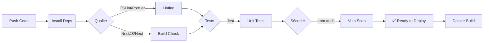

# Projet Collector
## Superviser et assurer le développement des applications logicielles

<!--
⏱️ Durée estimée : 1 min
- **Accroche** : "Bonjour, je suis Lucas Labonde, Lead Dev pour Collector."
- **Objet** : Soutenance de validation du bloc "Superviser le développement".
- **Plan** : Structuration (Qualité) -> Réalisation (MVP) -> Remédiation (Sécurité).
-->

---
layout: two-cols
---

# L'Entreprise : Collector

<div class="text-sm">

### 🏢 Identité & Contexte
- **Start-up** (5 ans) : Évènementiel (Salons objets pop-culture/vintage).
- **Situation** : Incubateur, Wifi partagé, IT limité (Office 365, Exchange).
- **Transition** : Levée de fonds pour lancer "Collector.shop".

### 👥 L'Équipe & Ma Mission
- **Direction** : 2 co-fondatrices (ex-Chefs de Projet IT).
- **Squad IT** :
  - **Moi : Lead Developer** (Pilotage, Architecture, Qualité).
  - 2 Développeurs Confirmés.
- **Support** : RH, Com/Marketing Digital.

</div>

::right::

<div class="flex h-full items-center justify-center p-8">
  <div class="bg-gray-100 p-6 rounded-xl text-center shadow-lg dark:bg-gray-800">
    <div class="font-bold text-xl mb-4">De l'Évènementiel...</div>
    <div class="text-5xl mb-4">🎪</div>
    <div class="text-xs opacity-75 mb-6">Salons physiques, Partenariats</div>
    <div class="text-2xl mb-6">⬇️</div>
    <div class="text-5xl mb-4">💻</div>
    <div class="font-bold text-xl">...au Digital</div>
    <div class="text-xs opacity-75 mt-2">Collector.shop (V1)</div>
  </div>
</div>

<!--
⏱️ Durée estimée : 2 min
- **Contexte** : Start-up mature en pivot digital (évènementiel -> web).
- **Contrainte** : IT hérité faible (Wifi public, pas d'infra), besoin de tout construire.
- **Mon Rôle** : Pas juste dev, mais *Lead* -> Structurer, Choisir les technos, Monter en compétence l'équipe (k8s).
-->

---
layout: default
---

# Vision & Exigences (V1)

**Objectif** : Une plateforme C2C de vente d'objets de collection, sécurisée et scalable.

<div class="grid grid-cols-2 gap-8 mt-6">

<div class="bg-white dark:bg-gray-800 p-4 rounded-lg shadow-sm border-l-4 border-blue-500">
  <h3 class="font-bold text-lg mb-2 text-blue-600">📦 Fonctionnel (MVP)</h3>
  <ul class="text-xs space-y-2">
    <li>👤 <strong>Profils</strong> : Acheteur / Vendeur / Admin.</li>
    <li>💬 <strong>Social</strong> : Chat (Filtre info perso), Notifications.</li>
    <li>🔍 <strong>Catalogue</strong> : Recommandations, Filtres.</li>
    <li>💳 <strong>Transaction</strong> : Paiement CB, Commission 5%, Validation Articles.</li>
  </ul>
</div>

<div class="bg-white dark:bg-gray-800 p-4 rounded-lg shadow-sm border-l-4 border-purple-500">
  <h3 class="font-bold text-lg mb-2 text-purple-600">⚙️ Technique & Contraintes</h3>
  <ul class="text-xs space-y-2">
    <li>🛡️ <strong>Sécurité (Critique)</strong> : HTTPS, Auth Forte, Détection Fraude (Prix).</li>
    <li>🌍 <strong>Accessibilité</strong> : i18n, Responsive.</li>
    <li>📈 <strong>Évolutivité</strong> : Architecture pour futures features (Enchères, Live).</li>
    <li>🏗️ <strong>Env.</strong> : Passage du "Site Vitrine WP" à une "App Métier".</li>
  </ul>
</div>

</div>

<!--
⏱️ Durée estimée : 2 min
- **Vision** : MVP fonctionnel mais *secure by design* (Commission 5%, Paiement CB).
- **Points critiques** :
    - Filtre Chat : "On ne veut pas que les gens échangent leurs numéros" (Perte de commission).
    - Fraude prix : "Alerte si un objet à 100€ passe à 1€".
-->

---
layout: default
---

# Backlog & User Stories (MVP)

Traduction des exigences en fonctionnalités concrètes.

<div class="grid grid-cols-1 gap-4 mt-6">

<div class="bg-white dark:bg-gray-800 p-4 rounded-lg shadow-sm border-l-4 border-green-500">
  <h3 class="font-bold text-lg mb-1 text-green-600">📝 US-01 : Mise en vente</h3>
  <p class="text-sm italic opacity-80 mb-2">"En tant que Vendeur, je veux publier une annonce avec des photos pour vendre un objet."</p>
  <ul class="text-xs list-disc pl-5">
    <li><strong>Critères d'acceptation</strong> : Au moins 1 photo, Description détaillée, Prix > 0€.</li>
    <li><strong>Tech</strong> : Stockage S3/Local, Validation Zod.</li>
  </ul>
</div>

<div class="bg-white dark:bg-gray-800 p-4 rounded-lg shadow-sm border-l-4 border-blue-500">
  <h3 class="font-bold text-lg mb-1 text-blue-600">💳 US-02 : Transaction Sécurisée</h3>
  <p class="text-sm italic opacity-80 mb-2">"En tant qu'Acheteur, je veux payer par carte sans partager mes données perso au vendeur."</p>
  <ul class="text-xs list-disc pl-5">
    <li><strong>Critères d'acceptation</strong> : Paiement Stripe, Commission 5% déduite, Statut "Vendu".</li>
    <li><strong>Tech</strong> : Stripe Webhooks, Atomic Transaction (Prisma).</li>
  </ul>
</div>

<div class="bg-white dark:bg-gray-800 p-4 rounded-lg shadow-sm border-l-4 border-red-500">
  <h3 class="font-bold text-lg mb-1 text-red-600">🛡️ US-03 : Détection de Fraude</h3>
  <p class="text-sm italic opacity-80 mb-2">"En tant qu'Admin, je veux être notifié si un prix varie suspectement."</p>
  <ul class="text-xs list-disc pl-5">
    <li><strong>Critères d'acceptation</strong> : Notification si variation > 30%, Log de l'événement.</li>
    <li><strong>Tech</strong> : Event Emitter, JSON Logger.</li>
  </ul>
</div>

</div>

<!--
- **Méthodo** : J'ai traduit le besoin métier en US techniques.
- **Focus** : US-02 (Paiement) est la plus critique (Atomicité, Sécurité).
- **Tech** : Choix de Prisma pour les transactions atomiques (ACID).

💡 **Cheat Sheet : Definitions**
- **User Story (US)** : Description courte d'une fonctionnalité vue par l'utilisateur ("En tant que... je veux... afin de...").
- **Critère d'acceptation** : Conditions précises pour considérer l'US comme "terminée" (ex: "Le bouton est vert").
- **Atomicité** : Tout ou rien. Si le paiement échoue, la commande n'est pas créée. Pas de demi-mesure.
-->

---
layout: default
---

# Sommaire de la Mission

Déroulement du projet en 3 phases structurantes :

<div class="grid grid-cols-3 gap-6 mt-8 text-center">

<div class="bg-blue-50 dark:bg-blue-900 p-4 rounded-xl shadow-lg border-t-4 border-blue-500">
  <div class="text-4xl mb-3">🏗️</div>
  <h3 class="font-bold text-lg mb-2 text-blue-700 dark:text-blue-300">1. Structuration</h3>
  <div class="text-xs text-left space-y-2 opacity-90 px-2">
    <p>✅ Qualité (ISO 25010)</p>
    <p>✅ Cycle DevSecOps</p>
    <p>✅ Compétences & Formation</p>
  </div>
</div>

<div class="bg-green-50 dark:bg-green-900 p-4 rounded-xl shadow-lg border-t-4 border-green-500">
  <div class="text-4xl mb-3">🚀</div>
  <h3 class="font-bold text-lg mb-2 text-green-700 dark:text-green-300">2. Réalisation</h3>
  <div class="text-xs text-left space-y-2 opacity-90 px-2">
    <p>✅ Choix Techniques & POC</p>
    <p>✅ Dév. Fonctionnalités</p>
    <p>✅ Pipeline CI/CD</p>
  </div>
</div>

<div class="bg-purple-50 dark:bg-purple-900 p-4 rounded-xl shadow-lg border-t-4 border-purple-500">
  <div class="text-4xl mb-3">🛡️</div>
  <h3 class="font-bold text-lg mb-2 text-purple-700 dark:text-purple-300">3. Remédiation</h3>
  <div class="text-xs text-left space-y-2 opacity-90 px-2">
    <p>✅ Audit de Sécurité</p>
    <p>✅ Tests de Charge</p>
    <p>✅ Plan d'Amélioration</p>
  </div>
</div>

</div>

---
layout: section
---

# Phase 1 : Structuration du Processus
## Qualité, Méthodologie & Compétences

---
layout: default
---

# Qualité Logicielle & Indicateurs

Approche basée sur la norme **ISO 25010** pour éviter la dette technique.

<div class="grid grid-cols-2 gap-8 mt-6">

<div class="bg-blue-50 dark:bg-blue-900 p-5 rounded-xl">
  <h3 class="font-bold text-xl mb-4 text-blue-700 dark:text-blue-300">📊 4 Indicateurs Clés</h3>
  <ul class="space-y-3">
    <li>🔹 <strong>Fiabilité</strong> : Couverture de Tests Unitaires (> 80%).</li>
    <li>🔹 <strong>Maintenabilité</strong> : Respect des standards (ESLint/Prettier).</li>
    <li>🔹 <strong>Sécurité</strong> : 0 Vulnérabilités critiques (Audit npm/Trivy).</li>
    <li>🔹 <strong>Performance</strong> : Temps de réponse API < 200ms.</li>
  </ul>
</div>

<div class="bg-green-50 dark:bg-green-900 p-5 rounded-xl">
  <h3 class="font-bold text-xl mb-4 text-green-700 dark:text-green-300">🔄 Une approche DevSecOps</h3>
  <div class="text-sm opacity-90">
    <p class="mb-2">Intégration de la sécurité à chaque étape :</p>
    <ul class="list-disc pl-4 space-y-1">
      <li><strong>Plan</strong> : Threat Modeling</li>
      <li><strong>Code</strong> : Linters & Typos</li>
      <li><strong>Build</strong> : SAST (Static Analysis)</li>
      <li><strong>Test</strong> : DAST (Dynamic Analysis)</li>
      <li><strong>Deploy</strong> : Hardening Infra</li>
    </ul>
  </div>
</div>

</div>

<!--
⏱️ Durée estimée : 2 min
- **Qualité** : ISO 25010 n'est pas juste théorique.
- **Fiabilité** : Tests unitaire > 80% (condition sine qua non pour le CI).
- **Sécurité** : DevSecOps = Sécurité *pendant* le dev, pas à la fin.

💡 **Cheat Sheet : Definitions**
- **ISO 25010** : Norme internationale pour évaluer la qualité logicielle. Elle définit 8 critères (Fonctionnalité, Performance, Compatibilité, Utilisabilité, Fiabilité, Sécurité, Maintenabilité, Portabilité).
- **Pourquoi l'utiliser ?** : Pour avoir un langage commun et ne rien oublier dans le cahier des charges.
- **Dette Technique** : Coût futur de reprise du code "mal fait" aujourd'hui.
-->

---
layout: default
---

# Équipe & Montée en Compétences

Cartographie des compétences pour assurer la réussite du projet.

<div class="grid grid-cols-2 gap-8 mt-6">

<div class="bg-yellow-50 dark:bg-yellow-900 p-5 rounded-xl border-l-4 border-yellow-500">
  <h3 class="font-bold text-xl mb-4 text-yellow-700 dark:text-yellow-300">👥 Compétences Actuelles</h3>
  <ul class="space-y-3 text-sm">
    <li>👨‍💻 <strong>Lead Dev (Moi)</strong> : Architecture, NestJS, DevOps (CI/CD).</li>
    <li>👨‍💻 <strong>Devs Confirmés (x2)</strong> : Frontend (React), SQL.</li>
    <li>🧪 <strong>Lacunes Identifiées</strong> : Kubernetes (K8s), Sécurité Avancée (Pentest).</li>
  </ul>
</div>

<div class="bg-blue-50 dark:bg-blue-900 p-5 rounded-xl border-l-4 border-blue-500">
  <h3 class="font-bold text-xl mb-4 text-blue-700 dark:text-blue-300">🎓 Plan de Formation (Action)</h3>
  <div class="text-sm opacity-90">
    <p class="mb-2 font-bold">Action : "Kubernetes for Developers"</p>
    <ul class="list-disc pl-4 space-y-1">
      <li><strong>Objectif</strong> : Maîtriser le déploiement et le scaling.</li>
      <li><strong>Format</strong> : Workshop pratique de 3 jours.</li>
      <li><strong>Résultat attendu</strong> : Autonomie sur le cluster de production (V2).</li>
    </ul>
  </div>
</div>

</div>

<!--
- **Analyse** : on est bons en dev (React/Nest), mais faibles en Ops modernes (K8s).
- **Action** : Formation K8s *maintenant* pour être prêt pour la V2 (qui sera sur K8s).
-->

---
layout: section
---

# Phase 2 : Réalisation & Déploiement
## Architecture, Tech Stack & CI/CD

---
layout: two-cols
---

# Architecture Technique

<div class="text-sm">

L'architecture est **modulaire**, **conteneurisée** et séparée (Front/Back) pour la scalabilité.


### 🎨 Frontend (Next.js)
- **SSR/SEO** : Optimisé pour le référencement.
- **UX** : React, TailwindCSS, ShadcnUI.

### 🧠 Backend (NestJS)
- **Robuste** : Architecture modulaire, TypeScript.
- **Data** : Prisma ORM (Type-safe).
- **Sécurité** : Throttler (Rate Limit), Helmet.

### 💾 Data & Observabilité
- **Data** : PostgreSQL, Redis (Cache).
- **Logs** : JsonLogger (Structured Logging) pour traçabilité.
- **Monitoring** : Health Checks (Terminus).

</div>

::right::

<div class="flex h-full items-center justify-center p-4">
  <div class="bg-gray-100 p-4 rounded-xl shadow-lg dark:bg-gray-800 w-full text-center">
    <div class="font-bold mb-4">Architecture Dockerisée</div>
    <div class="grid grid-cols-1 gap-4">
      <div class="p-3 bg-blue-100 dark:bg-blue-800 rounded">Frontend (Next.js)</div>
      <div class="text-xl">⬇️ ⬆️</div>
      <div class="p-3 bg-green-100 dark:bg-green-800 rounded">Backend (NestJS)</div>
      <div class="grid grid-cols-2 gap-2">
        <div class="text-xl">⬇️</div>
        <div class="text-xl">⬇️</div>
      </div>
      <div class="grid grid-cols-2 gap-4">
        <div class="p-3 bg-indigo-100 dark:bg-indigo-800 rounded">PostgreSQL</div>
        <div class="p-3 bg-red-100 dark:bg-red-800 rounded">Redis</div>
      </div>
    </div>
  </div>
</div>

<!--
⏱️ Durée estimée : 3 min
- **Choix Front** : Next.js pour le SEO (indispensable pour un site e-commerce).
- **Choix Back** : NestJS pour le cadre stricte (Entreprise) et TypeScript de bout en bout.
- **Data** : PostgreSQL (Fiable) + Redis (Rapide).

💡 **Cheat Sheet : Definitions**
- **SSR (Server-Side Rendering)** : Le serveur génère le HTML -> Google adore ça (SEO).
- **SEO** : Optimisation pour les moteurs de recherche (être en haut sur Google).
- **NestJS** : Framework Node.js structuré (comme Angular mais pour le back).
- **Redis** : Base de données en mémoire ultra-rapide, utilisée ici pour le Cache et les Sessions.
-->

---
layout: default
---

# Pipeline CI/CD (GitHub Actions)

Automatisation complète de la validation et de la qualité.



<div class="mt-8 grid grid-cols-3 gap-4 text-center text-sm">
  <div class="p-2 border border-green-500 rounded text-green-600 font-bold">1. Qualité</div>
  <div class="p-2 border border-blue-500 rounded text-blue-600 font-bold">2. Validation</div>
  <div class="p-2 border border-red-500 rounded text-red-600 font-bold">3. Sécurité</div>
</div>

---
layout: default
---

# Zoom Backend : NestJS & Prisma

Structure modulaire et typage fort pour la maintenabilité.

<div class="grid grid-cols-2 gap-4">

<div>

### 🧱 Module Principal (`app.module.ts`)
Configuration globale : Rate Limiting, Queues (Bull), Cache (Redis).

```typescript {all|9-12|5-6}
@Module({
  imports: [
    ConfigModule.forRoot({ isGlobal: true }),
    // 🛡️ Rate Limiting Global
    ThrottlerModule.forRoot([{
      ttl: 60000,
      limit: 10,
    }]),
    // 📦 Modules Fonctionnels
    PrismaModule,
    UsersModule,
    PaymentModule,
  ],
  controllers: [AppController],
})
export class AppModule {}
```

</div>

<div>

### 💾 Modèle de Données (`schema.prisma`)
Relationnel strict et intégrité des données.

```prisma {all|1-5|11}
model Transaction {
  id        String   @id @default(cuid())
  amount    Float
  status    String   @default("PENDING")
  // 🔗 Relations
  buyer     User     @relation("Buyer", fields: [buyerId], references: [id])
  seller    User     @relation("Seller", fields: [sellerId], references: [id])
  item      Item     @relation(fields: [itemId], references: [id])
  
  commission Float    @default(0) // 5%
}
```

</div>

</div>

<!--
- **Preuve par le Code (Backend)** :
- Montrer `app.module.ts` -> On voit `ThrottlerModule` (Rate Limit) -> Sécurité active.
- Montrer `schema.prisma` -> Typage fort, relations claires (User <-> Transaction).
-->

---
layout: default
---

# Zoom Frontend : Next.js Server Components

Performance et SEO grâce au rendu serveur (RSC).

<div class="grid grid-cols-2 gap-4">

<div>

### ⚡ Page d'Accueil (`HomePage.tsx`)
Accès direct à la BDD via Prisma (Secure Context).

```tsx {all|2|12-19}
// 🔒 Server Component (Code exécuté sur le serveur uniquement)
import { prisma } from "@/lib/prisma";

export async function HomePage({ searchParams }) {
  // 🚀 Fetch items directly from DB
  const items = await prisma.item.findMany({
    where: { 
      status: "AVAILABLE",
      published: true 
    },
    include: { images: true },
    orderBy: { createdAt: "desc" },
  });

  // 🖼️ Pass data to Client Components
  return (
    <div className="grid grid-cols-3 gap-4">
       {items.map(item => <ProductCard item={item} />)}
    </div>
  );
}
```

</div>

<div>

### 🎨 Pourquoi Next.js ?
1.  **Zéro Bundle JS** pour le code serveur (Prisma, Secrets).
2.  **SEO Natif** : Le HTML arrive pré-généré au navigateur.
3.  **Performance** : Requêtes BDD locales (pas d'API REST interne).

</div>

</div>

<!--
- **Preuve par le Code (Frontend)** :
- On fetch la donnée *directement* dans le composant (Server Component).
- Résultat : Pas d'API publique exposée pour rien + SEO parfait pour Google.
-->

---
layout: center
class: text-center bg-green-600 text-white
---

# 🎬 Démonstration
*(Parcours complet : Vendeur - Acheteur - Admin)*

<!--
🛑 **STOP** : Lancer la démo ici.
Scénario à jouer :
1.  Vendeur met en vente un objet (upload photo).
2.  Acheteur voit l'objet, l'ajoute au panier.
3.  Admin reçoit une notif de prix suspect (optionnel).
-->

---
layout: section
---

# Phase 3 : Remédiation & Sécurité
## Audit, Tests de Charge & Plan d'Action

---
layout: default
---

# Stratégie de Sécurité
  
Une approche **Défense en Profondeur** pour protéger les données.

<div class="grid grid-cols-1 gap-8 mt-6">

<div class="bg-red-50 dark:bg-red-900 p-6 rounded-xl border-l-4 border-red-500">
  <h3 class="font-bold text-xl mb-4 text-red-700 dark:text-red-300">🛡️ Mesures Implémentées</h3>
  <div class="grid grid-cols-2 gap-4">
    <ul class="space-y-3 text-sm">
      <li>🔒 <strong>Transport & Données</strong> : HTTPS (Self-signed), Secrets chiffrés (AES).</li>
      <li>🔑 <strong>Authentification</strong> : JWT (Stateless) + 2FA (TOTP Admin).</li>
    </ul>
    <ul class="space-y-3 text-sm">
      <li>🚫 <strong>Protection DoS</strong> : Rate Limiting (Throttler + Redis).</li>
      <li>🛡️ <strong>Hardening</strong> : Helmet (CSP, XSS, Clickjacking).</li>
    </ul>
  </div>
</div>

</div>

<!--
⏱️ Durée estimée : 2 min
- **Message Clé** : On a dépassé le MVP fonctionnel pour avoir un MVP *Sécurisé*.
- **Points forts** : Le Rate Limiting (crucial pour le e-commerce) et le 2FA Admin.

💡 **Cheat Sheet : Definitions**
- **Défense en Profondeur** : Ne pas compter sur une seule barrière. On sécurise le réseau, l'app, les données...
- **Rate Limiting** : Limiter le nombre de requêtes par seconde pour éviter de se faire spammer (DDoS).
- **JWT (JSON Web Token)** : Jeton d'identité sécurisé. "Le passeport numérique de l'utilisateur".
- **Self-signed HTTPS** : HTTPS créé par nous-mêmes (pas par une autorité officielle) pour le dev local.
-->

---
layout: default
---

# Validation de la Performance

Tests de charge pour garantir la scalabilité (Artillery).

<div class="grid grid-cols-1 gap-8 mt-6">

<div class="bg-purple-50 dark:bg-purple-900 p-6 rounded-xl border-l-4 border-purple-500">
  <h3 class="font-bold text-xl mb-4 text-purple-700 dark:text-purple-300">📉 Résultats des Tests de Charge</h3>
  <div class="grid grid-cols-2 gap-8 items-center">
    <div class="text-sm opacity-90">
      <p class="mb-2 font-bold">Scénario de Stress :</p>
      <ul class="list-disc pl-4 space-y-2">
        <li>👥 <strong>Charge</strong> : 50 utilisateurs simultanés sur 1 min.</li>
        <li>🌊 <strong>Flux</strong> : Login -> Recherche -> Ajout Panier.</li>
      </ul>
    </div>
    <div class="text-sm opacity-90">
      <p class="mb-2 font-bold">Métriques Clés :</p>
      <ul class="list-disc pl-4 space-y-2">
        <li>✅ <strong>Succès</strong> : 100% des requêtes valides (sous la limite).</li>
        <li>⏱️ <strong>Latence</strong> : p95 < 150ms (Objectif < 200ms).</li>
        <li>🛡️ <strong>Comportement</strong> : Rejet immédiat (429) si > limite.</li>
      </ul>
      <div class="mt-4 p-2 bg-black text-green-400 font-mono text-xs rounded shadow-lg">
        > artillery run stress-test.yml<br>
        ALL CHECKS PASSED ✅
      </div>
    </div>
  </div>
</div>

</div>

---
layout: default
---

# Zoom Sécurité : Défense en Profondeur

Comment nous protégeons l'application (`main.ts`).

<div class="grid grid-cols-2 gap-6">

<div>
### 🛡️ Hardening HTTP (Helmet)
Protection contre XSS, Clickjacking et Sniffing.

```typescript
app.use(
  helmet({
    contentSecurityPolicy: {
      directives: {
        defaultSrc: ["'self'"],
        scriptSrc: ["'self'", 'js.stripe.com'],
        // ...
      },
    },
    frameguard: { action: 'deny' }, // Anti-Clickjacking
    xssFilter: true,
  }),
);
```
</div>

<div>
### ✅ Validation & Sanitization
Nettoyage automatique des entrées/sorties.

```typescript
// Validation des DTOs (Data Transfer Objects)
app.useGlobalPipes(
  new ValidationPipe({
    whitelist: true, // 🗑️ Rejette les champs inconnus
    forbidNonWhitelisted: true,
  }),
);

// 🧼 Sanitization (Interceptor)
// Supprime les mots de passe des réponses JSON
app.useGlobalInterceptors(new SanitizeInterceptor());
```
</div>

</div>

---
layout: default
---

# Bilan du Projet (V1)

Retour d'expérience sur le cycle de développement.

<div class="grid grid-cols-2 gap-8 mt-8">

<div class="bg-green-50 dark:bg-green-900 p-5 rounded-xl border-l-4 border-green-500">
  <h3 class="font-bold text-xl mb-4 text-green-700 dark:text-green-300">✅ Objectifs Atteints</h3>
  <ul class="space-y-3 text-sm">
    <li>🎯 **Architecture** : Modulaire (NestJS), découplée et conteneurisée.</li>
    <li>🚀 **DevOps** : Pipeline CI/CD complet (Qualité, Tests, Secu).</li>
    <li>🛡️ **Sécurité** : Bases saines (Auth, Nettoyage, Chiffrement).</li>
  </ul>
</div>

<div class="bg-orange-50 dark:bg-orange-900 p-5 rounded-xl border-l-4 border-orange-500">
  <h3 class="font-bold text-xl mb-4 text-orange-700 dark:text-orange-300">💡 Apprentissage & Défis</h3>
  <ul class="space-y-3 text-sm">
    <li>⚡ **Injection de Dépendance** : Compréhension fine du cycle de vie NestJS.</li>
    <li>🐳 **Docker Networking** : Communication inter-conteneurs (App <-> DB <-> Redis).</li>
    <li>🧪 **Tests E2E** : Mocking des services externes (Stripe).</li>
  </ul>
</div>

</div>

---
layout: default
---

# Roadmap & Remédiation (Future V2)

Plan d'action pour passer à l'échelle industrielle.

<div class="grid grid-cols-3 gap-6 mt-8 text-sm">

<div class="p-5 border border-gray-300 dark:border-gray-700 rounded-xl bg-white dark:bg-gray-800 shadow-sm hover:shadow-md transition-shadow">
  <div class="font-bold text-lg mb-3 text-blue-600">1. Infrastructure 🏗️</div>
  <p class="opacity-80">Migration vers <strong>Kubernetes</strong> (K8s) pour gérer la haute disponibilité (ReplicaSets) et le scaling automatique (HPA).</p>
</div>

<div class="p-5 border border-gray-300 dark:border-gray-700 rounded-xl bg-white dark:bg-gray-800 shadow-sm hover:shadow-md transition-shadow">
  <div class="font-bold text-lg mb-3 text-purple-600">2. Observabilité 📊</div>
  <p class="opacity-80">Stack complète <strong>ELK</strong> (Elasticsearch, Logstash, Kibana) ou Loki/Grafana pour centraliser les logs et tracer les erreurs.</p>
</div>

<div class="p-5 border border-gray-300 dark:border-gray-700 rounded-xl bg-white dark:bg-gray-800 shadow-sm hover:shadow-md transition-shadow">
  <div class="font-bold text-lg mb-3 text-green-600">3. Fonctionnel 🌟</div>
  <p class="opacity-80">Implémentation du module d'<strong>Enchères</strong> en Temps Réel (WebSockets) et validation KYC.</p>
</div>

</div>

---
layout: center
class: text-center bg-blue-900 text-white
---

# Merci de votre écoute ! 🎤

<div class="mt-8 opacity-80">
  <p class="text-xl">Place aux Questions / Réponses</p>
  <p class="mt-4 text-sm">Lucas Labonde - Lead Developer Collector</p>
</div>

<!--
- **Conclusion** : La V1 est solide (Tech, processus, sécurité).
- **Avenir** : La V2 passera à l'échelle industrielle avec K8s.
- **Merci** : "Je suis prêt pour vos questions."
-->

<!-- global-bottom -->
<div class="absolute bottom-0 right-0 p-2 opacity-50 text-xs">
  <SlideCurrentNo /> / <SlideTotal />
</div>
