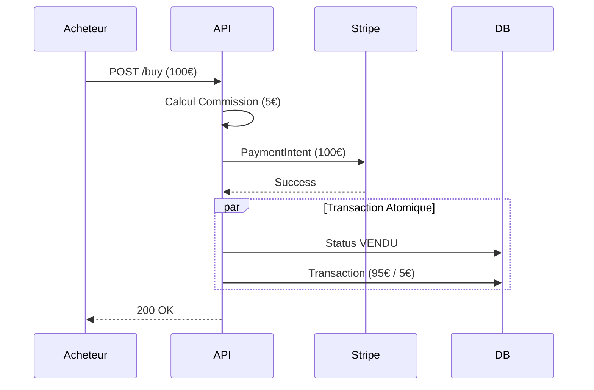

# Projet Collector
## Architecture & Industrialisation
### Plateforme E-Commerce C2C

<div class="text-center mt-8 opacity-75">
  <p>Lucas Labonde - Lead Developer</p>
  <p class="text-sm">Présentation Technique - 20 minutes</p>
</div>

<!--
 Durée estimée : 1 min
- **Sujet** : Construction from scratch d'une plateforme C2C (Collector).
- **Focus** : Qualité, Sécurité (DevSecOps) et Scalabilité.
- **Rôle** : Architecte Logiciel & Lead Developer.
-->

---
layout: two-cols
---

# Contexte & Enjeux

###  Le Projet

Collector est une plateforme de vente d'objets de collection entre particuliers. L'entreprise, initialement orientée événementiel, a levé des fonds pour développer une application web sécurisée et scalable.

###  Mes Objectifs (Lead Dev)

En tant que Lead Developer, ma mission consiste à :
- **Architecture** : Concevoir une solution modulaire et évolutive
- **Industrialisation** : Mettre en place les bonnes pratiques dès le départ
- **Sécurité** : Garantir une approche "Secure by Design"

::right::

<div class="flex h-full items-center justify-center p-6">
  <div class="bg-gray-50 p-6 rounded-xl shadow-md border-t-4 border-blue-500 w-full dark:bg-gray-800">
    <div class="font-bold text-xl mb-6 text-blue-700 dark:text-blue-300 text-center">Défis Techniques</div>
    
    <div class="space-y-6">
        <div class="flex items-center space-x-4">
            <div>
                <div class="font-bold">Confiance & Sécurité</div>
                <div class="text-sm opacity-75">Transactions financières sécurisées et prévention de la fraude</div>
            </div>
        </div>
        <div class="flex items-center space-x-4">
            <div>
                <div class="font-bold">Dette Technique Maîtrisée</div>
                <div class="text-sm opacity-75">Application des normes ISO 25010 et rigueur architecturale</div>
            </div>
        </div>
        <div class="flex items-center space-x-4">
            <div>
                <div class="font-bold">Time-to-Market</div>
                <div class="text-sm opacity-75">Automatisation complète via CI/CD</div>
            </div>
        </div>
    </div>

  </div>
</div>

<!--
 Durée estimée : 2 min
- **Contexte** : Greenfield project avec la responsabilité de faire les bons choix architecturaux dès le départ.
- **Problématique** : Comment garantir qu'une application partagée entre plusieurs développeurs ne devienne pas difficile à maintenir ?
- **Réponse** : Rigueur (Typage fort), Processus (CI/CD) et Standards (Architecture Modulaire).
-->

---
layout: default
---

# Vision & Exigences (V1)

<div class="text-center mb-6">
  <p class="text-lg">Objectif : Construire une plateforme C2C sécurisée, scalable et conforme aux exigences métier.</p>
</div>

<div class="grid grid-cols-2 gap-8 mt-8">

<div class="bg-white dark:bg-gray-800 p-5 rounded-lg shadow-sm border-l-4 border-blue-500">
  <h3 class="font-bold text-lg mb-3 text-blue-600"> Fonctionnel (MVP)</h3>
  <ul class="text-sm space-y-2">
    <li> <strong>Profils</strong> : Gestion des rôles Acheteur, Vendeur et Admin</li>
    <li> <strong>Social</strong> : Chat sécurisé et système de notifications</li>
    <li> <strong>Catalogue</strong> : Recherche avancée avec filtres par catégorie</li>
    <li> <strong>Transaction</strong> : Paiement sécurisé par CB avec commission de 5%</li>
  </ul>
</div>

<div class="bg-white dark:bg-gray-800 p-5 rounded-lg shadow-sm border-l-4 border-purple-500">
  <h3 class="font-bold text-lg mb-3 text-purple-600"> Socle Technique</h3>
  <ul class="text-sm space-y-2">
    <li> <strong>Sécurité</strong> : Authentification JWT, validation Zod, chiffrement Argon2</li>
    <li> <strong>Architecture</strong> : Backend modulaire NestJS avec ORM Prisma</li>
    <li> <strong>Infrastructure</strong> : Conteneurisation Docker, prêt pour Kubernetes</li>
    <li> <strong>Frontend</strong> : Next.js pour le SEO et les performances</li>
  </ul>
</div>

</div>

<div class="mt-8 text-center">
   <div class="opacity-75 italic text-sm border rounded p-3 bg-gray-50 dark:bg-gray-800">
     Architecture centrée sur la sécurité des transactions et la modularité pour faciliter l'évolution
   </div>
</div>

<!--
 Durée estimée : 2 min
- **Vision** : MVP fonctionnel mais *secure by design*.
- **Points critiques** :
    - Filtre Chat : Empêcher l'échange d'informations personnelles (email, téléphone)
    - Détection fraude : Alertes sur les variations de prix suspectes
-->

---
layout: default
---

# Backlog & User Stories (MVP)

<div class="text-center mb-4">
  <p>Traduction des exigences métier en fonctionnalités techniques concrètes.</p>
</div>

<div class="grid grid-cols-1 gap-4 mt-6">

<div class="bg-white dark:bg-gray-800 p-4 rounded-lg shadow-sm border-l-4 border-green-500">
  <h3 class="font-bold text-lg mb-1 text-green-600"> US-01 : Mise en vente</h3>
  <p class="text-sm italic opacity-80 mb-2">"En tant que vendeur, je veux publier une annonce avec photos pour vendre mes objets."</p>
  <ul class="text-sm list-disc pl-5">
    <li><strong>Critères d'acceptation</strong> : Au moins 1 photo, prix supérieur à 0€, description obligatoire</li>
    <li><strong>Implémentation technique</strong> : Stockage S3, validation Zod, modération automatique</li>
  </ul>
</div>

<div class="bg-white dark:bg-gray-800 p-4 rounded-lg shadow-sm border-l-4 border-blue-500">
  <h3 class="font-bold text-lg mb-1 text-blue-600"> US-02 : Transaction Sécurisée</h3>
  <p class="text-sm italic opacity-80 mb-2">"En tant qu'acheteur, je veux payer par CB sans partager mes données bancaires."</p>
  <ul class="text-sm list-disc pl-5">
    <li><strong>Critères d'acceptation</strong> : Paiement via Stripe, commission 5% automatique, atomicité garantie</li>
    <li><strong>Implémentation technique</strong> : Webhooks Stripe, transactions Prisma, traçabilité complète</li>
  </ul>
</div>

<div class="bg-white dark:bg-gray-800 p-4 rounded-lg shadow-sm border-l-4 border-red-500">
  <h3 class="font-bold text-lg mb-1 text-red-600"> US-03 : Détection de Fraude</h3>
  <p class="text-sm italic opacity-80 mb-2">"En tant qu'admin, je veux être alerté automatiquement des prix suspects."</p>
  <ul class="text-sm list-disc pl-5">
    <li><strong>Critères d'acceptation</strong> : Alerte si variation de prix supérieure à 30%</li>
    <li><strong>Implémentation technique</strong> : Event Emitter NestJS, logs structurés JSON</li>
  </ul>
</div>

</div>

<!--
- **Méthode** : Transformation des besoins métier en User Stories techniques
- **Focus** : US-02 (Paiement) est critique car elle implique l'atomicité des transactions
-->

---
layout: default
---

# Sommaire de la Mission

<div class="text-center mb-6">
  <p>Déroulement du projet en 3 phases structurantes conformes aux exigences de l'évaluation.</p>
</div>

<div class="grid grid-cols-3 gap-6 mt-10 text-center">

<div class="bg-blue-50 dark:bg-blue-900 p-6 rounded-xl shadow-lg border-t-4 border-blue-500">
  <h3 class="font-bold text-xl mb-3 text-blue-700 dark:text-blue-300">1. Structuration</h3>
  <div class="text-sm text-left space-y-2 opacity-90 px-2 font-medium">
    <p>Politique de qualité ISO 25010</p>
    <p>Cycle DevSecOps formalisé</p>
    <p>Cartographie des compétences</p>
  </div>
</div>

<div class="bg-green-50 dark:bg-green-900 p-6 rounded-xl shadow-lg border-t-4 border-green-500">
  <h3 class="font-bold text-xl mb-3 text-green-700 dark:text-green-300">2. Réalisation</h3>
  <div class="text-sm text-left space-y-2 opacity-90 px-2 font-medium">
    <p>Expérimentation en bac à sable</p>
    <p>Développement du POC</p>
    <p>Pipeline CI/CD complet</p>
  </div>
</div>

<div class="bg-purple-50 dark:bg-purple-900 p-6 rounded-xl shadow-lg border-t-4 border-purple-500">
  <h3 class="font-bold text-xl mb-3 text-purple-700 dark:text-purple-300">3. Remédiation</h3>
  <div class="text-sm text-left space-y-2 opacity-90 px-2 font-medium">
    <p>Audit de sécurité</p>
    <p>Tests de charge</p>
    <p>Plan d'action priorisé</p>
  </div>
</div>

</div>

---
layout: section
---

# Phase 1 : Structuration
## Qualité, Méthodologie & Compétences

---
layout: default
---

# Qualité Logicielle : Stratégie ISO 25010

<div class="text-center mb-4">
  <p>Mise en place d'une démarche qualité standardisée pour éviter l'accumulation de dette technique.</p>
</div>

<div class="grid grid-cols-2 gap-8 mt-8">

<div class="bg-blue-50 dark:bg-blue-900 p-6 rounded-xl border-l-4 border-blue-500">
  <h3 class="font-bold text-xl mb-4 text-blue-700 dark:text-blue-300"> Pourquoi ISO 25010 ?</h3>
  <ul class="space-y-4 text-sm">
    <li>🔹 <strong>Langage Commun</strong> : Facilite l'alignement entre équipes techniques et métier sur les objectifs qualité</li>
    <li>🔹 <strong>Exhaustivité</strong> : Couvre tous les aspects critiques (Performance, Sécurité, Maintenabilité, Fiabilité)</li>
    <li>🔹 <strong>Mesurable</strong> : Permet de définir des indicateurs chiffrés et objectifs pour suivre la qualité</li>
  </ul>
</div>

<div class="bg-gray-50 dark:bg-gray-800 p-6 rounded-xl border-l-4 border-gray-500 text-center flex flex-col justify-center">
    <div class="text-6xl mb-4">💎</div>
    <div class="font-bold text-xl">Objectif Principal</div>
    <div class="text-lg opacity-80 mt-2">Réduire la Dette Technique</div>
    <div class="text-sm opacity-70 mt-4">En appliquant des standards de qualité dès la conception</div>
</div>

</div>

---
layout: default
---

# Indicateurs Qualité

<div class="text-center mb-4">
  <p>Quatre indicateurs clés pour mesurer et garantir la qualité logicielle du projet.</p>
</div>

<div class="mt-8">
  <QualityIndicators />
</div>

<div class="mt-6 bg-blue-50 dark:bg-blue-900 p-4 rounded-xl border-l-4 border-blue-500">
  <h3 class="font-bold text-lg text-blue-700 dark:text-blue-300"> Lien avec la Dette Technique</h3>
  <p class="text-sm mt-2">
    Ces métriques permettent de détecter précocement les problèmes et d'éviter l'accumulation de dette technique :
  </p>
  <ul class="text-sm mt-2 space-y-1 list-disc pl-5">
    <li>La couverture de tests garantit la non-régression lors des évolutions</li>
    <li>Le temps de build rapide encourage les déploiements fréquents</li>
    <li>Les vulnérabilités détectées tôt évitent les corrections coûteuses en production</li>
    <li>Le temps de réponse surveille la dégradation des performances</li>
  </ul>
</div>

<!--
- **Qualité** : ISO 25010 n'est pas juste théorique, elle se traduit en métriques concrètes
- **Fiabilité** : Couverture de tests > 80% pour garantir la stabilité
- **Sécurité** : DevSecOps = Sécurité intégrée *pendant* le développement
-->

---
layout: default
---

# Politique de Test : Stratégie Pyramidale

<div class="text-center mb-4">
  <p>Une approche structurée pour obtenir un feedback rapide et fiable à chaque niveau de l'application.</p>
</div>

<div class="grid grid-cols-2 gap-6 mt-4">

<div class="h-80 flex items-center justify-center">
  <TestPyramidChart />
</div>

<div class="flex flex-col justify-center">
  <div class="bg-white dark:bg-gray-800 p-6 rounded-xl shadow-sm border-l-4 border-green-500">
    <h3 class="font-bold text-lg mb-4 text-green-700 dark:text-green-300"> Répartition Cible</h3>
    <ul class="space-y-3 text-sm">
      <li> <strong>80% Tests Unitaires (Jest)</strong><br><span class="opacity-75">Validation de la logique métier pure, exécution ultra-rapide (< 1s)</span></li>
      <li> <strong>15% Tests d'Intégration (Supertest)</strong><br><span class="opacity-75">Validation des interactions avec la base de données (Prisma + PostgreSQL)</span></li>
      <li> <strong>5% Tests E2E (Playwright)</strong><br><span class="opacity-75">Validation des parcours utilisateurs critiques (achat complet)</span></li>
    </ul>
  </div>
</div>

</div>

---
layout: default
---

# Implémentation des Tests

<div class="text-center mb-4">
  <p>Les outils et fichiers concrets utilisés pour chaque niveau de la pyramide de tests.</p>
</div>

<div class="grid grid-cols-1 gap-6 mt-8">

<div class="bg-green-50 dark:bg-green-900 p-4 rounded-xl border-l-4 border-green-500 shadow-sm">
  <h3 class="font-bold text-lg text-green-700 dark:text-green-300">Tests Unitaires (Jest)</h3>
  <p class="text-sm opacity-90 mb-1">Validation de la logique métier pure sans dépendances externes.</p>
  <code class="text-xs bg-white dark:bg-black px-2 py-1 rounded">tests/unit/commission.service.spec.ts</code>
</div>

<div class="bg-yellow-50 dark:bg-yellow-900 p-4 rounded-xl border-l-4 border-yellow-500 shadow-sm">
  <h3 class="font-bold text-lg text-yellow-700 dark:text-yellow-300">Tests d'Intégration (Supertest)</h3>
  <p class="text-sm opacity-90 mb-1">Validation des API et de leurs interactions avec la base de données (environnement Docker).</p>
  <code class="text-xs bg-white dark:bg-black px-2 py-1 rounded">tests/integration/auth.controller.spec.ts</code>
</div>

<div class="bg-red-50 dark:bg-red-900 p-4 rounded-xl border-l-4 border-red-500 shadow-sm">
  <h3 class="font-bold text-lg text-red-700 dark:text-red-300">Tests E2E (Playwright)</h3>
  <p class="text-sm opacity-90 mb-1">Simulation complète du parcours utilisateur de bout en bout.</p>
  <code class="text-xs bg-white dark:bg-black px-2 py-1 rounded">tests/e2e/purchase.spec.ts</code>
</div>

</div>

<!--
- **Stratégie** : Tests unitaires pour une base solide, intégration pour la BDD, E2E pour les parcours métier critiques
-->

---
layout: default
---

# Tests & Métriques Qualité

<div class="text-center mb-4">
  <p>Comment les tests automatisés permettent de suivre nos 4 indicateurs qualité.</p>
</div>

<div class="grid grid-cols-2 gap-6 mt-6">

<div class="bg-blue-50 dark:bg-blue-900 p-5 rounded-xl border-l-4 border-blue-500">
  <h3 class="font-bold text-lg mb-3 text-blue-700 dark:text-blue-300">Couverture de Tests</h3>
  <p class="text-sm mb-2"><strong>Indicateur :</strong> > 80%</p>
  <p class="text-sm opacity-90"><strong>Mesure :</strong> Jest coverage report dans le pipeline CI/CD</p>
  <p class="text-sm opacity-75 mt-2">Garantit la non-régression lors des évolutions</p>
</div>

<div class="bg-green-50 dark:bg-green-900 p-5 rounded-xl border-l-4 border-green-500">
  <h3 class="font-bold text-lg mb-3 text-green-700 dark:text-green-300">Temps de Build</h3>
  <p class="text-sm mb-2"><strong>Indicateur :</strong> < 5 min</p>
  <p class="text-sm opacity-90"><strong>Mesure :</strong> GitHub Actions workflow duration</p>
  <p class="text-sm opacity-75 mt-2">Encourage les déploiements fréquents</p>
</div>

<div class="bg-red-50 dark:bg-red-900 p-5 rounded-xl border-l-4 border-red-500">
  <h3 class="font-bold text-lg mb-3 text-red-700 dark:text-red-300">Vulnérabilités</h3>
  <p class="text-sm mb-2"><strong>Indicateur :</strong> 0 critique</p>
  <p class="text-sm opacity-90"><strong>Mesure :</strong> Trivy scan + npm audit dans CI</p>
  <p class="text-sm opacity-75 mt-2">Détection précoce avant production</p>
</div>

<div class="bg-purple-50 dark:bg-purple-900 p-5 rounded-xl border-l-4 border-purple-500">
  <h3 class="font-bold text-lg mb-3 text-purple-700 dark:text-purple-300">Temps de Réponse</h3>
  <p class="text-sm mb-2"><strong>Indicateur :</strong> p95 < 200ms</p>
  <p class="text-sm opacity-90"><strong>Mesure :</strong> Artillery stress tests</p>
  <p class="text-sm opacity-75 mt-2">Surveille la dégradation des performances</p>
</div>

</div>

---
layout: default
---

# Stratégie de Sécurité : Shift Left

<div class="text-center mb-4">
  <p>Approche DevSecOps : la sécurité est intégrée à chaque étape du cycle de développement, pas uniquement à la fin.</p>
</div>

<div class="h-96 mt-2">
  <SecurityLifecycle />
</div>

---
layout: default
---

# Implémentation de la Sécurité

<div class="text-center mb-4">
  <p>Mesures de sécurité concrètes appliquées au niveau du code, du pipeline et de l'infrastructure.</p>
</div>

<div class="grid grid-cols-2 gap-6 mt-6">

<div class="bg-white dark:bg-gray-800 p-5 rounded-xl shadow-sm border-l-4 border-blue-500">
  <h3 class="font-bold text-lg mb-3 text-blue-700 dark:text-blue-300"> Code & Application</h3>
  <ul class="space-y-3 text-sm">
    <li><strong>Validation Zod</strong><br><span class="text-xs opacity-75">Rejet strict et automatique des entrées invalides côté backend</span></li>
    <li><strong>Helmet (Headers HTTP)</strong><br><span class="text-xs opacity-75">Protection contre XSS, Clickjacking et autres attaques web courantes</span></li>
    <li><strong>Argon2</strong><br><span class="text-xs opacity-75">Algorithme de hashing robuste et moderne pour les mots de passe</span></li>
  </ul>
</div>

<div class="bg-white dark:bg-gray-800 p-5 rounded-xl shadow-sm border-l-4 border-red-500">
  <h3 class="font-bold text-lg mb-3 text-red-700 dark:text-red-300"> Pipeline & Infrastructure</h3>
  <ul class="space-y-3 text-sm">
    <li><strong>Trivy Scan</strong><br><span class="text-xs opacity-75">Analyse automatique des vulnérabilités dans les images Docker (blocage si critique)</span></li>
    <li><strong>npm audit</strong><br><span class="text-xs opacity-75">Vérification continue des dépendances Node.js pour détecter les failles</span></li>
    <li><strong>Rate Limiting (Redis)</strong><br><span class="text-xs opacity-75">Protection contre les attaques par force brute et les tentatives de DDoS</span></li>
  </ul>
</div>

</div>

<!--
- **Message Clé** : MVP *Sécurisé* dès la V1
- **Points forts** : Rate Limiting et Hashing robuste
-->

---
layout: default
---

# Équipe & Montée en Compétences

<div class="text-center mb-4">
  <p>Cartographie des compétences actuelles et plan de formation pour garantir la réussite du projet.</p>
</div>

<div class="mt-6">

| Compétence | Niveau Actuel | Niveau Cible | Action |
| :--- | :---: | :---: | :--- |
| **Développement React/Node** | ⭐⭐⭐⭐ | ⭐⭐⭐⭐ | Veille technologique continue |
| **DevOps (Docker)** | ⭐⭐⭐ | ⭐⭐⭐⭐ | Pratique sur le projet |
| **Sécurité Applicative** | ⭐⭐ | ⭐⭐⭐⭐ | **Workshop OWASP Top 10** |
| **Kubernetes** | ⭐ | ⭐⭐ | **Formation K8s certifiante** |

<div class="mt-8 bg-blue-50 dark:bg-blue-900 p-6 rounded-xl border-l-4 border-blue-500">
  <h3 class="font-bold text-lg text-blue-700 dark:text-blue-300">🎓 Plan d'Action Détaillé</h3>
  <p class="text-sm mt-2">
    <strong>Priorité immédiate</strong> : Formation intensive sur la sécurité applicative (OWASP Top 10) pour garantir la robustesse de la V1.<br>
    <strong>Moyen terme</strong> : Formation Kubernetes (CKA) pour préparer la migration de la V2 vers une infrastructure orchestrée et hautement disponible.
  </p>
</div>

</div>

<!--
- **Analyse** : L'équipe est solide en développement, mais nécessite un renforcement en sécurité et DevOps
- **Action** : Formation K8s pour anticiper les besoins de la V2
-->

---
layout: section
---

# Phase 2 : Réalisation
## Architecture, Tech Stack & CI/CD

---
layout: default
---

# Architecture Technique

<div class="text-center mb-4">
  <p>Architecture conteneurisée et modulaire conçue pour la scalabilité et la maintenabilité.</p>
</div>

<div class="h-96 mt-2">
  <ArchitectureDiagram />
</div>

---
layout: default
---

# Détails de la Stack Technique

<div class="text-center mb-4">
  <p>Choix technologiques justifiés par le contexte du projet et les exigences de qualité.</p>
</div>

<div class="grid grid-cols-3 gap-6 mt-8">

<div class="bg-blue-50 dark:bg-blue-900 p-5 rounded-xl border-t-4 border-blue-500 shadow-sm">
  <h3 class="font-bold text-lg mb-3 text-blue-700 dark:text-blue-300"> Frontend</h3>
  <div class="font-bold mb-2">Next.js</div>
  <ul class="text-xs space-y-2 opacity-90">
    <li> <strong>SSR/SEO</strong> : Améliore la visibilité sur les moteurs de recherche</li>
    <li> <strong>UX</strong> : React avec Tailwind CSS pour une interface moderne</li>
    <li> <strong>Performance</strong> : Optimisation automatique des images et fonts</li>
  </ul>
</div>

<div class="bg-green-50 dark:bg-green-900 p-5 rounded-xl border-t-4 border-green-500 shadow-sm">
  <h3 class="font-bold text-lg mb-3 text-green-700 dark:text-green-300"> Backend</h3>
  <div class="font-bold mb-2">NestJS</div>
  <ul class="text-xs space-y-2 opacity-90">
    <li> <strong>Structure</strong> : Architecture modulaire et maintenable</li>
    <li> <strong>Sécurité</strong> : Guards et intercepteurs intégrés</li>
    <li> <strong>Typage</strong> : TypeScript de bout en bout</li>
  </ul>
</div>

<div class="bg-purple-50 dark:bg-purple-900 p-5 rounded-xl border-t-4 border-purple-500 shadow-sm">
  <h3 class="font-bold text-lg mb-3 text-purple-700 dark:text-purple-300">Data</h3>
  <div class="font-bold mb-2">PostgreSQL + Redis</div>
  <ul class="text-xs space-y-2 opacity-90">
    <li> <strong>Fiabilité</strong> : Transactions ACID garanties</li>
    <li> <strong>Vitesse</strong> : Cache Redis pour les performances</li>
    <li> <strong>Logs</strong> : Logs structurés en JSON (Pino)</li>
  </ul>
</div>

</div>

<!--
 Durée estimée : 3 min
- **Choix Frontend** : Next.js pour le SEO (indispensable pour un site e-commerce)
- **Choix Backend** : NestJS pour le cadre strict (Enterprise-grade) et TypeScript de bout en bout
- **Data** : PostgreSQL (Fiable) + Redis (Rapide)
-->

---
layout: default
---

# Expérimentation "Bac à Sable"

<div class="text-center mb-4">
  <p>Protocole de validation technique avant tout développement pour minimiser les risques.</p>
</div>

<div class="mt-6">
  <SandboxProtocol />
</div>

<div class="mt-6 bg-blue-50 dark:bg-blue-900 p-4 rounded-xl border-l-4 border-blue-500">
  <h3 class="font-bold text-lg text-blue-700 dark:text-blue-300"> Méthodologie d'Expérimentation</h3>
  <p class="text-sm mt-2">
    Chaque technologie critique est testée en <strong>isolation complète via Docker</strong> avant son adoption.<br>
    <strong>Critères d'évaluation</strong> : Qualité de la documentation, type-safety, maturité de l'écosystème, facilité de test.
  </p>
</div>

<!--
- **Protocole** : On ne code pas à l'aveugle, chaque choix est validé
- **Docker** : Environnement isolé pour des tests reproductibles
-->

---
layout: default
---

# Résultats des Expérimentations

<div class="text-center mb-4">
  <p>Bilan des tests en bac à sable avant l'adoption définitive des technologies.</p>
</div>

<div class="grid grid-cols-2 gap-6 mt-6">

<div class="bg-green-50 dark:bg-green-900 p-5 rounded-xl border-l-4 border-green-500">
  <h3 class="font-bold text-lg mb-3 text-green-700 dark:text-green-300"> Technologies Validées</h3>
  <ul class="space-y-3 text-sm">
    <li>
      <strong>Docker Compose</strong>
      <br><span class="text-xs opacity-75">Solution simple et efficace pour la V1 (Kubernetes reporté à la V2)</span>
    </li>
    <li>
      <strong>Prisma ORM</strong>
      <br><span class="text-xs opacity-75">Meilleure productivité et sécurité comparé à TypeORM</span>
    </li>
    <li>
      <strong>Stripe CLI</strong>
      <br><span class="text-xs opacity-75">Simulation parfaite des webhooks de paiement en local</span>
    </li>
  </ul>
</div>

<div class="bg-orange-50 dark:bg-orange-900 p-5 rounded-xl border-l-4 border-orange-500">
  <h3 class="font-bold text-lg mb-3 text-orange-700 dark:text-orange-300">Challenges Rencontrés & Solutions</h3>
  <ul class="space-y-3 text-sm">
    <li>
      <strong>Réseau Docker</strong>
      <br><span class="text-xs opacity-75"><strong>Problème :</strong> DNS interne instable entre conteneurs (backend ↔ postgres)</span>
      <br><span class="text-xs opacity-75"><strong>Solution :</strong> Configuration explicite des networks dans docker-compose.yml</span>
    </li>
    <li>
      <strong>Authentification Hybride</strong>
      <br><span class="text-xs opacity-75"><strong>Problème :</strong> Synchronisation des sessions NextAuth (Frontend) avec NestJS Guards (Backend)</span>
      <br><span class="text-xs opacity-75"><strong>Solution :</strong> JWT partagé avec validation côté backend via passport-jwt</span>
    </li>
    <li>
      <strong>CI/CD</strong>
      <br><span class="text-xs opacity-75"><strong>Problème :</strong> Client Prisma non généré dans l'environnement CI</span>
      <br><span class="text-xs opacity-75"><strong>Solution :</strong> Ajout de <code>prisma generate</code> dans le script de build</span>
    </li>
  </ul>
</div>

</div>

<div class="mt-4 text-center text-sm opacity-70 italic bg-gray-100 dark:bg-gray-800 p-2 rounded">
  Stack validée et prête pour la production. Migration Kubernetes planifiée pour la V2.
</div>

---
layout: default
---

# Focus Fonctionnel : La Commission

<div class="text-center mb-4">
  <p>Implémentation de la règle métier critique : prélèvement automatique de 5% sur chaque transaction.</p>
</div>

<div class="grid grid-cols-2 gap-8 mt-8 items-center">

<div class="text-xs transform scale-90 origin-top-left">

</div>

<div class="bg-indigo-50 dark:bg-indigo-900 p-6 rounded-xl border-l-4 border-indigo-500">
  <h3 class="font-bold text-lg mb-4 text-indigo-700 dark:text-indigo-300"> Modèle Économique</h3>
  <ul class="space-y-4 text-sm">
    <li>
      <strong>Transaction Atomique</strong>
      <br><span class="opacity-75">Garantie que soit tout réussit (paiement + commission), soit tout est annulé (rollback automatique)</span>
    </li>
    <li>
      <strong>Traçabilité Complète</strong>
      <br><span class="opacity-75">La commission est stockée dans une colonne dédiée <code>commission_amount</code> pour la facturation et la comptabilité</span>
    </li>
  </ul>
</div>

</div>

---
layout: default
---

# Pipeline CI/CD (GitHub Actions)

<div class="text-center mb-4">
  <p>Automatisation complète du processus de qualité et de déploiement.</p>
</div>

<div class="h-96 mt-2">
  <PipelineDiagram />
</div>

---
layout: default
---

# Zoom Backend : NestJS & Prisma

<div class="text-center mb-4">
  <p>Structure modulaire et typage fort pour garantir la maintenabilité.</p>
</div>

<div class="grid grid-cols-2 gap-4">

<div>

###  Module Principal (`app.module.ts`)
Configuration globale avec rate limiting et modules fonctionnels.

```typescript {all|9-12|5-6}
@Module({
  imports: [
    ConfigModule.forRoot({ isGlobal: true }),
    //  Rate Limiting Global
    ThrottlerModule.forRoot([{
      ttl: 60000,
      limit: 10,
    }]),
    //  Modules Fonctionnels
    PrismaModule,
    UsersModule,
    PaymentModule,
  ],
  controllers: [AppController],
})
export class AppModule {}
```

</div>

<div>

### Modèle (`schema.prisma`)
Schéma relationnel strict avec traçabilité.

```prisma {all|4-7|11}
model Transaction {
  id        String   @id @default(cuid())
  amount    Float
  status    String   @default("PENDING")
  //  Relations
  buyer     User     @relation("Buyer", fields: [buyerId], references: [id])
  seller    User     @relation("Seller", fields: [sellerId], references: [id])
  item      Item     @relation(fields: [itemId], references: [id])
  
  commission Float    @default(0) // 5%
}
```

</div>

</div>

<!--
- **Code Backend** :
- `ThrottlerModule` = Protection active contre les abus
- `schema.prisma` = Typage fort et relations explicites
-->

---
layout: default
---

# Zoom Frontend : Server Components

<div class="text-center mb-4">
  <p>Performance et SEO optimisés grâce au rendu serveur (React Server Components).</p>
</div>

<div class="grid grid-cols-2 gap-4">

<div>

###  Page d'Accueil (`page.tsx`)
Accès direct à la base de données dans un contexte sécurisé.

```tsx {all|2|12-19}
//  Server Component
import { prisma } from "@/lib/prisma";

export async function HomePage() {
  //  Fetch direct en base de données
  const items = await prisma.item.findMany({
    where: { 
      status: "AVAILABLE",
      published: true 
    },
    include: { images: true },
    orderBy: { createdAt: "desc" },
  });

  return (
    <div className="grid grid-cols-3 gap-4">
       {items.map(item => <ProductCard item={item} />)}
    </div>
  );
}
```

</div>

<div>

###  Avantages de Next.js

<div class="space-y-4 text-sm mt-4">
  <div class="bg-green-50 dark:bg-green-900 p-3 rounded">
    <strong>1. Zero Bundle JS</strong><br>
    <span class="text-xs opacity-75">Le code serveur n'est jamais envoyé au client</span>
  </div>
  <div class="bg-blue-50 dark:bg-blue-900 p-3 rounded">
    <strong>2. SEO Natif</strong><br>
    <span class="text-xs opacity-75">HTML pré-généré pour les moteurs de recherche</span>
  </div>
  <div class="bg-purple-50 dark:bg-purple-900 p-3 rounded">
    <strong>3. Performance</strong><br>
    <span class="text-xs opacity-75">Pas d'API intermédiaire inutile</span>
  </div>
</div>

</div>

</div>

<!--
- **Code Frontend** :
- Fetch direct dans le composant = Pas d'API publique inutile
- SEO optimal pour une marketplace
-->

---
layout: default
---

# Observabilité : Logs Structurés (Pino)

<div class="text-center mb-4">
  <p>Système de logging structuré pour faciliter le monitoring et le debug en production.</p>
</div>

<div class="grid grid-cols-2 gap-8 mt-6">

<div class="bg-white dark:bg-gray-800 p-5 rounded-xl shadow-sm border-l-4 border-indigo-500">
  <h3 class="font-bold text-lg mb-3 text-indigo-700 dark:text-indigo-300"> Avantages des Logs JSON</h3>
  <ul class="space-y-3 text-sm">
    <li>
      <strong>Parsable</strong>
      <br><span class="text-xs opacity-75">Facilement automatisable avec des outils comme ELK, Datadog ou Grafana Loki</span>
    </li>
    <li>
      <strong>Contexte Riche</strong>
      <br><span class="text-xs opacity-75">Inclusion automatique de `requestId`, `userId` pour tracer les requêtes</span>
    </li>
    <li>
      <strong>Standard</strong>
      <br><span class="text-xs opacity-75">Format unifié pour tous les microservices de l'application</span>
    </li>
  </ul>
</div>

<div>
  <h3 class="font-bold text-lg mb-3"> Exemple de Log</h3>

```json
{
  "level": "info",
  "time": 1708185600000,
  "requestId": "req-a1b2c3",
  "msg": "Order created",
  "amount": 100,
  "commission": 5
}
```

  <div class="mt-4 bg-green-50 dark:bg-green-900 p-3 rounded-lg text-sm">
    <strong> Production</strong> : Collecte via `docker logs`, centralisation future avec ELK Stack.
  </div>
</div>

</div>

<!--
- **Observabilité** : Logs JSON = Standard moderne et automatisable
- **Pino** : Ultra-rapide et performant
-->

---
layout: center
class: text-center bg-green-600 text-white
---

#  Démonstration Live

<div class="text-xl mt-8">
  <p>Parcours complet : Vendeur → Acheteur → Admin</p>
</div>

<!--
🛑 **STOP** : Lancer la démonstration en direct
-->

---
layout: default
---

# Validation de la Performance

<div class="text-center mb-4">
  <p>Tests de charge avec Artillery : simulation de 50 utilisateurs simultanés.</p>
</div>

<div class="grid grid-cols-5 gap-6 mt-4">

<div class="col-span-3 h-72">
  <PerformanceChart />
</div>

<div class="col-span-2 flex flex-col justify-center space-y-4">
  <div class="bg-green-50 dark:bg-green-900 p-4 rounded-xl border-l-4 border-green-500">
    <p class="font-bold text-green-700 dark:text-green-300"> Résultats Obtenus</p>
    <ul class="text-sm space-y-1 mt-2">
      <li> <strong>100% de succès</strong> sur toutes les requêtes</li>
      <li> <strong>p95 < 200ms</strong> (temps de réponse)</li>
      <li> <strong>Rate Limiting fonctionnel</strong></li>
    </ul>
  </div>
  <div class="p-3 bg-black text-green-400 font-mono text-xs rounded shadow-lg">
    $ artillery run stress-test.yml<br>
    ALL CHECKS PASSED 
  </div>
</div>

</div>

---
layout: section
---

# Phase 3 : Remédiation & Sécurité
## Audit, Tests de Charge & Plan d'Action

---
layout: default
---

# Audit de Sécurité et Remédiation

<div class="text-center mb-4">
  <p>Analyse des vulnérabilités détectées et plan d'action priorisé pour la V2.</p>
</div>

| Vulnérabilité | Sévérité | Statut V1 | Solution Implémentée / Planifiée |
| :--- | :---: | :---: | :--- |
| **Injection SQL** |  Critique |  Protégé | Prisma ORM avec requêtes paramétrées |
| **Faille XSS** |  Élevée |  Protégé | React automatic escaping + Helmet |
| **Brute Force** |  Élevée |  Protégé | Rate Limiting Redis (10 req/min) |
| **DDoS** |  Moyenne | ❌ V2 | WAF Cloudflare (planifié) |

<div class="mt-4 h-56">
  <SecurityRadarChart />
</div>

---
layout: default
---

# Bilan du Projet (V1)

<div class="text-center mb-4">
  <p>Rétrospective sur les réussites et les apprentissages du projet.</p>
</div>

<div class="grid grid-cols-2 gap-8 mt-8">

<div class="bg-green-50 dark:bg-green-900 p-5 rounded-xl border-l-4 border-green-500">
  <h3 class="font-bold text-xl mb-4 text-green-700 dark:text-green-300"> Succès</h3>
  <ul class="space-y-3 text-sm">
    <li> <strong>Architecture</strong> : Solution modulaire et conteneurisée réussie</li>
    <li> <strong>DevOps</strong> : Pipeline CI/CD complet et fonctionnel</li>
    <li> <strong>Sécurité</strong> : Fondations saines avec DevSecOps</li>
    <li> <strong>Qualité</strong> : Couverture de tests > 80%</li>
  </ul>
</div>

<div class="bg-orange-50 dark:bg-orange-900 p-5 rounded-xl border-l-4 border-orange-500">
  <h3 class="font-bold text-xl mb-4 text-orange-700 dark:text-orange-300"> Leçons Apprises</h3>
  <ul class="space-y-3 text-sm">
    <li> <strong>NestJS</strong> : Courbe d'apprentissage de l'injection de dépendances</li>
    <li>🐳 <strong>Docker</strong> : Complexité de la communication réseau inter-conteneurs</li>
    <li>🧪 <strong>Tests</strong> : Difficulté du mocking des services externes (Stripe)</li>
  </ul>
</div>

</div>

---
layout: default
---

# Roadmap 2026 (Vers la V2)

<div class="text-center mb-4">
  <p>Plan d'action priorisé pour passer à l'échelle industrielle.</p>
</div>

<div class="grid grid-cols-3 gap-6 mt-8 text-sm">

<div class="p-5 border border-gray-300 dark:border-gray-700 rounded-xl bg-white dark:bg-gray-800 shadow-sm">
  <div class="font-bold text-lg mb-3 text-blue-600">1. Infrastructure </div>
  <p class="opacity-80">Migration vers <strong>Kubernetes</strong> pour le scaling automatique et la haute disponibilité.</p>
</div>

<div class="p-5 border border-gray-300 dark:border-gray-700 rounded-xl bg-white dark:bg-gray-800 shadow-sm">
  <div class="font-bold text-lg mb-3 text-purple-600">2. Observabilité </div>
  <p class="opacity-80">Déploiement d'une stack <strong>ELK</strong> ou Loki pour la centralisation des logs et métriques.</p>
</div>

<div class="p-5 border border-gray-300 dark:border-gray-700 rounded-xl bg-white dark:bg-gray-800 shadow-sm">
  <div class="font-bold text-lg mb-3 text-green-600">3. Fonctionnalités </div>
  <p class="opacity-80">Ajout des <strong>enchères en temps réel</strong> (WebSockets) et système KYC.</p>
</div>

</div>

---
layout: center
class: text-center bg-blue-900 text-white
---

# Merci de votre écoute ! 

<div class="mt-8 opacity-80">
  <p class="text-xl font-bold">Place aux Questions</p>
  <p class="mt-4 text-sm opacity-75">Lucas Labonde - Lead Developer Collector</p>
</div>

<!--
- **Conclusion** : V1 solide et prête pour la production
- **V2** : Préparée pour le passage à l'échelle avec Kubernetes
-->

<!-- global-bottom -->
<div class="absolute bottom-0 right-0 p-2 opacity-50 text-xs">
  <SlideCurrentNo /> / <SlideTotal />
</div>
