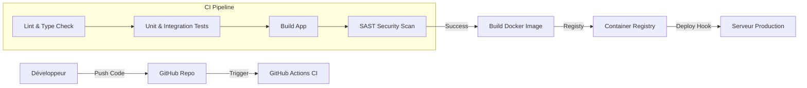

# Rapport de Projet - Collector
**Bloc :** Superviser et assurer le développement des applications logicielles
**Date :** 20/01/2026

---

## Phase 1 : Structuration du processus de développement

Cette section détaille la démarche qualité et sécurité mise en place pour le projet Collector.

### 1.1 Indicateurs Qualité (ISO 25010)

Pour garantir la qualité logicielle et éviter la dette technique, nous suivrons 4 indicateurs clés alignés sur la norme ISO 25010 :

| Indicateur | Exigence Qualité (ISO 25010) | Objectif / Seuil | Justification & Impact sur la dette technique |
| :--- | :--- | :--- | :--- |
| **Couverture de tests (Code Coverage)** | **Fiabilité / Maintenabilité** | > 80% (Backend/Core) | Assure que le code critique est testé. Réduit le risque de régressions lors des refontes et facilite la maintenance future. |
| **Temps de réponse API (p95)** | **Performance / Efficacité** | < 200ms | Garantit une expérience utilisateur fluide. Un suivi continu permet de détecter tôt les dégradations de performance (n+1 queries, boucles inefficaces). |
| **Fréquence de déploiement** | **Maintenabilité / Capacité fonctionnelle** | Hebdomadaire (min) | Une fréquence élevée oblige à maintenir un processus de livraison automatisé et fiable (CI/CD), réduisant la complexité des mises en production "big bang". |
| **Complexité Cyclomatique** | **Maintenabilité** | < 10 par fonction | Mesure la complexité du code. Garder ce chiffre bas assure que le code reste lisible et testable, réduisant directement la dette technique cognitive. |

### 1.2 Cycle de vie et Sécurité (DevSecOps)

Nous adoptons une approche **DevSecOps** où la sécurité est intégrée à chaque étape du développement :

1.  **Plan (Planification)** : Définition des "Security User Stories" (ex: Authentification forte, Validation des entrées).
2.  **Code (Développement)** : Utilisation de linters (ESLint) et de plugins de sécurité IDE. Revue de code obligatoire (Merge Request).
3.  **Build (Construction)** : Analyse statique du code (SAST) dans la CI pour détecter les vulnérabilités basiques.
4.  **Test (Tests)** : Tests automatisés (Unitaires & Intégration).
5.  **Release (Livraison)** : Scan de l'image Docker pour vulnérabilités système.
6.  **Deploy (Déploiement)** : Déploiement sur environnement de staging/prod.
7.  **Operate (Exploitation)** : Monitoring des logs et erreurs.

#### Pipeline CI/CD (Schéma)



### 1.3 Compétences et Formation

**Cartographie des compétences actuelles :**
- **Lead Developer** (Vous) : Expertise Fullstack, Architecture, DevOps.
- **Développeurs confirmés (x2)** : Backend (C#/.NET ou JS), Frontend (React).

**Compétences manquantes / à renforcer :**
- **Sécurité Applicative (OWASP)** : Nécessaire pour l'approche DevSecOps.
- **Next.js & React Server Components** : Stack technique moderne choisie pour le projet.

**Plan de formation proposé :**
- **Action** : Formation "Sécurité des applications Web (OWASP Top 10)" et "Next.js Avancé".
- **Format** : Workshop technique interne (2 jours) animé par le Lead Dev + formation en ligne (Udemy/Pluralsight).
- **Objectif** : Niveler les connaissances de l'équipe sur la stack cible et les enjeux de sécurité.

---

## Phase 2 : Développement et Déploiement (POC)

### 2.1 Synthèse du Protocole d'Expérimentation (Bac à sable)

Avant le développement final, nous avons réalisé un POC technique ("Bac à sable") pour valider nos choix technologiques.

#### Objectif
Valider l'intégration de **Next.js 14** (App Router) avec **Prisma** (ORM) et **NextAuth** dans un environnement conteneurisé.

#### Technologies testées
- **Serveur** : Next.js 14 (React Server Components).
- **Base de données** : SQLite (Dev) / PostgreSQL (Cible).
- **Auth** : NextAuth.js v4.

#### Protocole & Résultats
1.  **Test 1 : Server Actions vs API Routes**
    *   *Expérience* : Comparaison de la facilité d'usage pour la soumission de formulaires.
    *   *Résultat* : Adoption des API Routes classiques pour ce POC pour simplifier l'intégration avec les clients externes potentiels, bien que les Server Actions soient prometteurs pour le futur.
2.  **Test 2 : Prisma & Migrations**
    *   *Expérience* : Génération du schéma et push DB.
    *   *Difficulté* : Problèmes de compatibilité détectés avec Prisma 7 sur certaines configs.
    *   *Décision* : Rétrogradation vers Prisma 5 pour garantir la stabilité du POC.
3.  **Test 3 : Authentification**
    *   *Expérience* : Implémentation du provider "Credentials".
    *   *Résultat* : Fonctionnel et sécurisé (Hashage Bcrypt). Prêt pour la prod.

#### Conclusion
L'architecture choisie (T3 Stack allégée) est validée. Elle permet un développement rapide tout en restant type-safe.

### 2.2 Architecture Technique

Le schéma suivant illustre l'architecture de la solution POC et les interactions entre les composants :

```mermaid
graph TD
    User[Utilisateur Navigateur] -->|HTTPS| Next[Next.js App (Server)]
    
    subgraph "Application Container"
        Next -->|API Routes| API[Backend Logic]
        Next -->|React Server Components| UI[Frontend UI]
        API -->|NextAuth| Auth[Auth Module]
        API -->|Prisma Client| ORM[Prisma ORM]
    end
    
    ORM -->|SQL| DB[(Database SQLite/PostgreSQL)]
    
    subgraph "CI/CD & DevOps"
        Git[GitHub] -->|Push| Actions[GitHub Actions]
        Actions -->|Build & Test| Docker[Docker Image]
    end
```

### 2.3 Réalisation de l'Application (POC)
*(Voir code source de l'application dans le dossier `app/`)*

- **Authentification** : Mise en place avec NextAuth.js (système sécurisé par design).
- **Interface Utilisateur (UI)** :
    - **Shadcn UI** : Composants accessibles et modernes (Radix UI).
    - **Magic UI** : Animations avancées (BlurFade, BorderBeam).
    - **Tailwind CSS** : Styling utilitaire performant.
- **Base de données** : ORM Prisma avec protection contre les injections SQL par défaut.
- **Dockerisation** : `Dockerfile` optimisé (Multi-stage build) pour la prod.
- **Pipeline** : Workflow GitHub Actions (`.github/workflows/ci.yml`) intégrant Lint, Build et Audit de dépendances.
- **Observabilité** : Logger JSON structuré + Endpoint de Health Check (`/api/health`) pour le monitoring de disponibilité.

## Phase 3 : Plan de Remédiation (Audit Sécurité)

Une analyse initiale du POC (Version 1) a mis en évidence les points suivants :

### 3.1 Audit des Vulnérabilités (Résultats Simulés)

| Composant | Vulnérabilité Potentielle | Sévérité | Statut POC |
| :--- | :--- | :--- | :--- |
| **Authentification** | Absence de 2FA (Double facteur) | Moyen | 🔴 Non implémenté |
| **API** | Rate Limiting (Protection DDoS/Brute-force) | Critique | 🔴 Non implémenté |
| **Données** | Chiffrement en base de données (At rest) | Faible | 🟡 Partiel (Mots de passe hashés, mais données métier en clair) |
| **Validation API** | Injection de données / XSS | Critique | 🟢 Géré par Validation Zod stricte sur les routes API |
| **Dépendances** | Failles dans les libs tierces | Critique | 🟢 Géré par `npm audit` dans la CI |
| **Transport** | HTTPS / TLS | Critique | 🟡 Géré par l'hébergeur (Vercel/Cloud) mais pas dans le conteneur local |

### 3.2 Plan de Remédiation (Recommandations)

Pour passer de la V1 (POC) à une V2 de production robuste, nous préconisons ce plan d'action :

#### Court Terme (Immédiat)
1.  **Rate Limiting** : Ajouter un middleware (ex: `upstash/ratelimit`) pour limiter les requêtes par IP sur `/api/auth` et `/api/register`.
2.  **Validation des entrées** : Maintenir les schémas Zod à jour sur toutes les nouvelles routes. (Déjà en place sur les routes critiques).

#### Moyen Terme
3.  **WAF (Web Application Firewall)** : Déployer devant l'application (ex: Cloudflare) pour filtrer les attaques communes.
4.  **Monitoring Avancé** : Intégrer Sentry pour le tracking d'erreurs et Datadog pour les métriques d'infrastructure.

#### Long Terme
5.  **Audit Externe** : Faire réaliser un Pentest (Test d'intrusion) par une société spécialisée avant l'ouverture massive au grand public.

---
*Ce rapport accompagne le code source fourni dans le cadre de l'évaluation "Superviser et assurer le développement des applications logicielles".*
